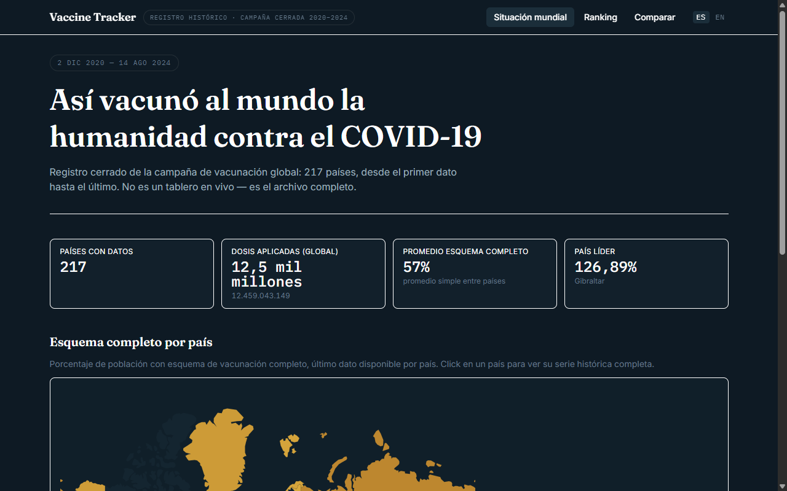

# Vaccine Tracker

Panel histórico de la vacunación COVID-19, país por país. Nació en 2021 como
tracker en vivo; la pandemia terminó y con ella el dominio del proyecto —
hoy es el **archivo completo**: 217 países, desde el primer dato hasta el
último, sin API en vivo ni backend. El dataset se hornea a build-time desde
[Our World in Data](https://ourworldindata.org/coronavirus/country/)
(licencia CC-BY, ver `src/data/README.md`) y se sirve estático.



## Qué tiene

- **Situación mundial** — mapa mundial coroplético + KPIs globales (dosis
  totales, cobertura promedio, país líder).
- **Ranking** — los 217 países ordenados por la métrica que elijas (esquema
  completo, al menos una dosis, dosis totales, refuerzos, o velocidad de
  vacunación: días hasta 50% de esquema completo).
- **Comparar** — hasta 4 países lado a lado, serie histórica completa,
  alineada por fecha calendario o por días desde el inicio de cada campaña.
- **Evolución animada** — la misma comparación, pero animada día a día
  (play/pausa, velocidad ajustable, scrubber) para ver cómo avanzó la
  vacunación en el tiempo.
- **Detalle de país** — cobertura + dosis diarias + fuentes + hito de 50%
  de esquema completo, por país.

Bilingüe (español / English) vía prefijo de URL (`/ranking` = español,
`/en/ranking` = inglés) — ver `src/i18n/`.

## Alcance

**Qué es**: un explorador de solo lectura del histórico de vacunación COVID
de OWID, con el dataset horneado a build-time.

**Qué no es**: no es un tracker en vivo (no hay fetch en runtime ni API), ni
un panel analítico multi-fuente (una sola fuente: OWID). Ampliar el alcance
(otra fuente de datos, ponderación por población, drill-down subnacional) es
una discusión de issue antes que un PR — ver `CONTRIBUTING.md`.

## Correr el proyecto

```sh
npm install
npm run dev
```

Abre [http://localhost:5173](http://localhost:5173).

## Scripts

- `npm run dev` — servidor de desarrollo (Vite).
- `npm run verify` — el mismo gate que corre CI: lint + test + build.
- `npm run generate:data` — regenera `src/data/` desde el CSV real de OWID
  (solo hace falta si OWID amplía su histórico o corrige datos retroactivos).
- `npm test` / `npm run lint` / `npm run build` — gates individuales.

## Stack

Vite + React 19 + TypeScript estricto + Tailwind v4 + shadcn/ui + ECharts
(import modular) + wouter + react-i18next. Detalle de cada decisión (y por
qué) en `CLAUDE.md` y `_audits/DECISIONES.md`.

## Datos

El dataset es histórico y fijo — no cambia en runtime, no hay tablero "en
vivo". Se genera una vez desde el CSV público de OWID y se versiona junto al
código; contrato completo, licencia del dato y manejo de países faltantes en
[`src/data/README.md`](src/data/README.md).

### Pipeline de build (resumen técnico)

`npm run generate:data` corre `scripts/generate-dataset.ts` sobre el CSV real
de [OWID](https://github.com/owid/covid-19-data/tree/master/public/data/vaccinations)
y produce el dataset columnar en `src/data/`:

- **Columnas**: se buscan por nombre en el CSV (no por posición), definidas en
  `src/data/types.ts` → `FIELDS`; agregar una columna nueva es una sola línea ahí.
- **Métricas derivadas**: `daysToFully50` se calcula a build-time desde la
  serie completa de cada país (`src/lib/milestones.ts`), no viene del CSV.
- **Países con datos faltantes**: `loadCountry`/`loadCountrySources`
  (`src/data/loader.ts`) nunca lanzan — un país sin archivo loguea el error y
  degrada a `null`/`{ sources: [] }`. `loadCountries` usa `Promise.allSettled`,
  así que un país roto no tumba el resto (evita el bug de home-en-blanco por
  `Promise.all` sin `.catch` del repo anterior).

Detalle completo (formato exacto de cada archivo, licencia, campos) en
[`src/data/README.md`](src/data/README.md).
